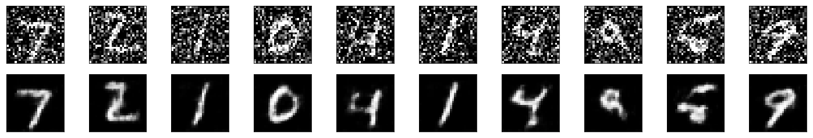
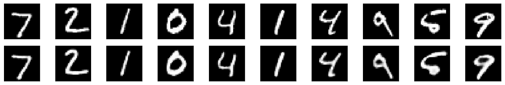
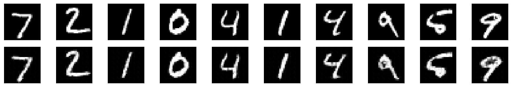

# Autoencoder - Models for Denoising, Compressing and Upsampling

This are CNN Autoencoder implementation of Denosiing, Compressing and Upsampling MNIST dataset 

Below are some samples of Autoecoder Result:

1. Denosing

2. Upsampling

3. Compressing and Decompression

There are 3 main parts of this model:

1. **Denoising**: Custom CNN Encodr & Decoder model for denosing images  

2. **Upsampling**: Custom CNN Encoder & Decoder model with upsampling 

3. **Compression & Decompression**: Custom Linear & CNN model for compressing and decompressing images

## List of Hyperparameters used:

* Encoder Model = **32 Conv2d Encoder Model**
* Decoder Model - **32 ConvTranspose2d Encoder Model**  
* Fully Connection Layers = **3**  
* Batch Size = **20**  
* Epoch = **20**  

* Loss Function = **MSELoss**  
* Optimizer  = **Adam**  
* Initial Learning Rate = **0.001**  

